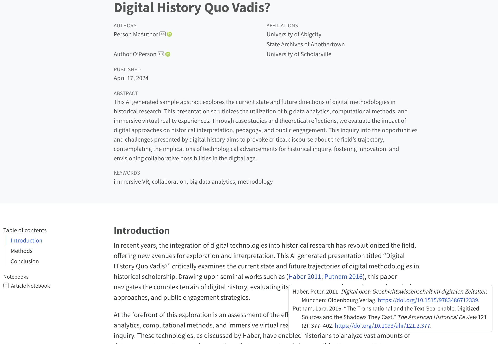

# Abstract Template for Digital History Switzerland 2024

Welcome to the official repository for the extended abstracts of the Digital History Switzerland 2024 conference. This repository aims to facilitate reproducible research by providing a standardized template for abstract submission. The data here is openly available to support and encourage transparency and collaboration in historical research.

[](https://github.com/digihistch24/abstract-template/issues)
[](https://github.com/digihistch24/abstract-template/network)
[](https://github.com/digihistch24/abstract-template/stargazers)
[](https://github.com/digihistch24/abstract-template/blob/main/LICENSE.md)

## Introduction

This repository hosts the standardized template for submitting extended abstracts to the Digital History Switzerland 2024 conference. It's designed to ensure uniformity in submissions, making the review process more efficient and accessible. And it is also aesthetically pleasing.



### Getting Started

To get started with the abstract template, follow these steps:

1. **Create a GitHub Account:**
   - If you do not already have a GitHub account, create one [here](https://github.com/signup) for free.

2. **Create Your Repository:**
   - Click the ["Use this template"](https://github.com/new?template_name=abstract-template&template_owner=digihistch24) button to start a new repository based on this template.
   - Enter a name for your repository and decide whether to make it public or private.
   - Click "Create repository from template" to set up your new project.

3. **Access and Edit Your Abstract:**
   - In your new repository, navigate to the `abstract-template` folder.
   - Find the `index.qmd` file and click on it.
   - Click the pencil icon (edit) in the top-right corner of the file view to begin editing.

4. **Commit Your Changes:**
   - After making your edits, scroll to the bottom of the page.
   - Enter a brief description of the changes you made in the "Commit changes" box.
   - Click "Commit changes" to save your edits.

5. **Preview and Collaborate:**
   - To preview your abstract, follow the steps in the "Previewing the Abstract" section below.
   - To collaborate, go to the "Settings" tab in your repository, choose "Manage access," and then "Invite a collaborator."

6. **Submit Your Abstract:**
   - When your abstract is ready for submission, download the repository as a ZIP file.
   - Send the ZIP file to the [conference organizers](mailto:digital-history-2024@unibas.ch) if your repository is private. If your repository is public, share the repository link with the organizers.

## Abstract structure

```markdown
---
submission_id: 499
title: Digital History Switzerland 2024 submission title
author:
  - name: Petra Huber
    orcid: 0000-0002-0760-5497
    email: petra.huber@university.ch
    affiliations:
      - University 1
  - name: Michel Meier
    orcid: 0000-0002-7859-8394
    email: michel.meier@university.edu
    affiliations:
      - University 1
      - University 2
keywords:
  - Keyword 1
  - Keyword 2
  - Keyword 3
  - Keyword 4 (optional)
  - Keyword 5 (optional)
abstract: |
  Short abstract of the submission. This is a placeholder for the abstract of the manuscript. It should be between 150 and 250 words. It must not contain any references or unexplained abbreviations.
key-points:
  - Key point 1 (1 sentence)
  - Key point 2 (1 sentence)
  - Key point 3 (1 sentence)
date: 03-17-2024
bibliography: references.bib
---

## Introduction

This is a placeholder for the extended abstract of the paper. It should be between 1500 and 2000 words (excluding references).

Check <https://quarto.org/docs/authoring/markdown-basics.html> for more information on how to use markdown, <https://quarto.org/docs/authoring/cross-references.html> for more information on how to use cross-references like this (See @fig-example and @fig-plots), and <https://quarto.org/docs/authoring/footnotes-and-citations.html> for more information on how to use citations like this one [@haber2011, p. 11].

::: {#fig-example}


:::

## Section 1

Lorem ipsum dolor sit amet, consectetur adipiscing elit. Sed non risus. Suspendisse lectus tortor, dignissim sit amet, adipiscing nec, ultricies sed, dolor. Cras elementum ultrices diam. Maecenas ligula massa, varius a, semper congue, euismod non, mi. Proin porttitor, orci nec nonummy molestie, enim est eleifend mi, non fermentum diam nisl sit amet erat. Duis semper. Duis arcu massa, scelerisque vitae, consequat in, pretium a, enim. Pellentesque congue. Ut in risus volutpat libero pharetra tempor. Cras vestibulum bibendum augue. Praesent egestas leo in pede. Praesent blandit odio eu enim. Pellentesque sed dui ut augue blandit sodales. Vestibulum ante ipsum primis in faucibus orci luctus et ultrices posuere cubilia Curae; Aliquam nibh. Mauris ac mauris sed pede pellentesque fermentum. Maecenas adipiscing ante non diam sodales hendrerit.
```

## Repository Structure

The structure of this repository is designed to be as simple as possible. The main files are:

- `submission` - The root directory of the repository.
  - `_quarto.yml` - The configuration file for the Quarto project.
  - `.gitignore` - The file specifies intentionally untracked files to ignore.
  - `index.qmd` - The main file of the abstract.
  - `references.bib` - The BibTeX file for the references.

### Previewing the Abstract from the Command Line

Previewing your document ensures it looks correct before submission. Here is how you can preview your abstract using the Quarto CLI:

1. **Install Quarto:**
   - Follow the detailed installation instructions on the [Quarto website](https://quarto.org/docs/get-started/).

2. **Open Your Terminal:**
   - Access your terminal or command prompt. On Windows, you can search for "cmd" or "Command Prompt" in your start menu. On macOS, open "Terminal" from your Applications/Utilities folder.

3. **Navigate to Your Repository:**
   - Use the `cd` command to change directories to the root directory of your repository. You can type `cd` (with a space after) and then drag and drop your repository folder into the terminal window to automatically fill in the path. Press Enter to change to that directory.

4. **Run the Preview Command:**
   - Type `quarto preview submission` and press Enter. Quarto will start a local server and open a preview of your abstract in your default web browser.

5. **Check for Errors:**
   - If you encounter any errors during preview, refer to the [Quarto documentation](https://quarto.org/docs/guide/) for troubleshooting or ask for help on the Discussions Page.

By following these enhanced instructions, users should find it easier to start working with the template, make necessary edits, and collaborate with others. These improvements aim to reduce confusion and streamline the user experience, particularly for those who may be new to using GitHub and Quarto.

## Community Engagement

We encourage the community to contribute by sharing successful abstracts or experiences. Join our [Discussions Page](https://github.com/orgs/digihistch24/discussions) to connect with other researchers.

## Contact Information

For further assistance, join our [Discussions Page](https://github.com/orgs/digihistch24/discussions) or contact the Organizing Committee at <digital-history-2024@unibas.ch>.

## Support

This project is maintained by [@digihistch24](https://github.com/digihistch24). Please understand that we can't provide individual support via email. We also believe that help is much more valuable when it's shared publicly, so more people can benefit from it.

| Type                                   | Platforms                                                               |
| -------------------------------------- | ----------------------------------------------------------------------- |
| 🚨 **Bug Reports**                     | [GitHub Issue Tracker](https://github.com/digihistch24/abstract-template/issues)    |
| 📚 **Docs Issue**                      | [GitHub Issue Tracker](https://github.com/digihistch24/abstract-template/issues)    |
| 🎁 **Feature Requests**                | [GitHub Issue Tracker](https://github.com/digihistch24/abstract-template/issues)    |
| 💬 **General Questions**               | [GitHub Discussions](https://github.com/orgs/digihistch24/discussions) |

## Roadmap

No changes are currently planned.

## Contributing

All contributions to this repository are welcome! If you find errors or problems with the data, or if you want to add new data or features, please open an issue or pull request. Please read [CONTRIBUTING.md](CONTRIBUTING.md) for details on our code of conduct and the process for submitting pull requests.

## Versioning

We use [SemVer](http://semver.org/) for versioning. The available versions are listed in the [tags on this repository](https://github.com/digihistch24/abstract-template/tags).

## Authors and acknowledgment

- **Moritz Mähr** - _Initial work_ - [maehr](https://github.com/maehr)
- **Moritz Twente** - _Contributor_ - [mtwente](https://github.com/mtwente)

See also the list of [contributors](https://github.com/digihistch24/abstract-template/graphs/contributors) who contributed to this project.

## License

The data in this repository is released under the Creative Commons Attribution Share Alike 4.0 International (CC BY 4.0) License - see the [LICENSE-CCBYSA](LICENSE-CCBYSA) file for details. By using this data, you agree to make any modifications available under the same license.
The code in this repository is released under the GNU Affero General Public License v3.0 - see the [LICENSE-AGPL](LICENSE-AGPL) file for details. By using this code, you agree to make any modifications available under the same license.
